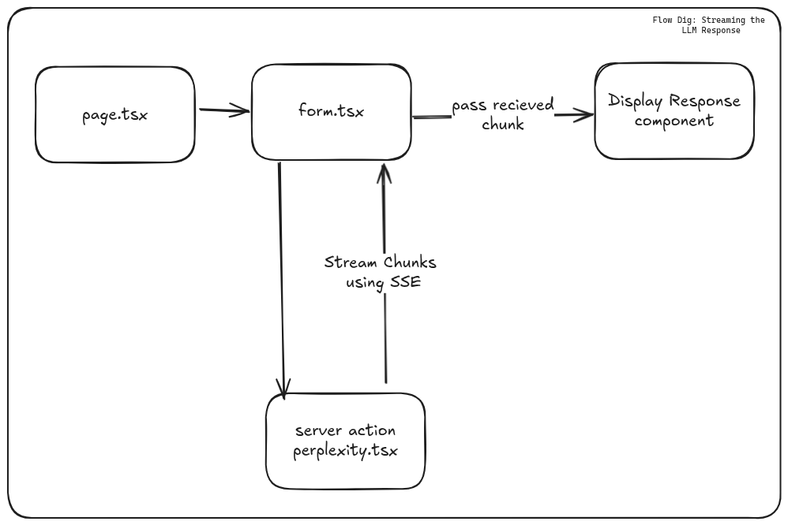
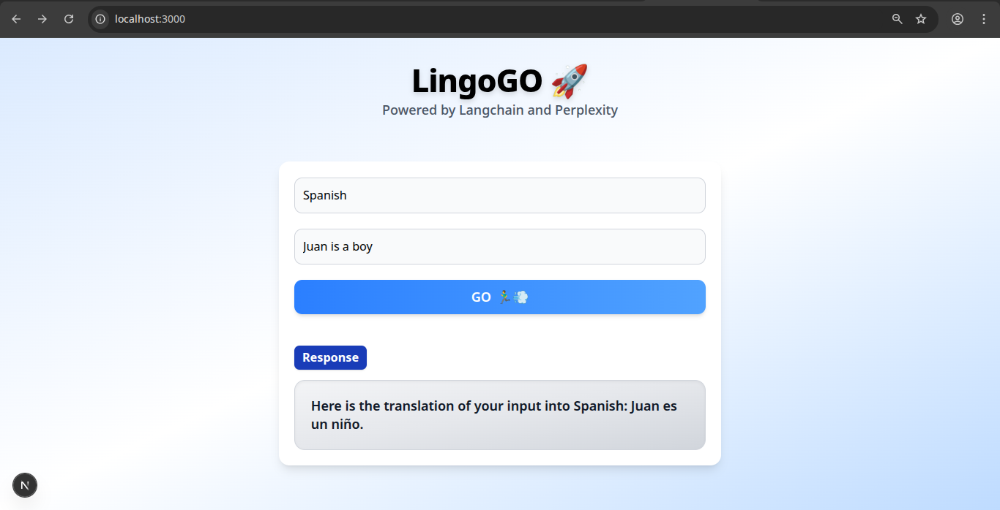

# V1

### Translator App - using chat models and prompt templates.

## Tech Stack

```
- Nextjs
- Langchain
- Perplexity API
```

### Goal - V1

- Simple prompt + configuration ✅
- Prompt template ✅
- User Input form ✅
- Refining LLM response ✅
- Response streaming(SSE) with UX ✅

### Flow Diagram



### Screen Shots 🖼️


