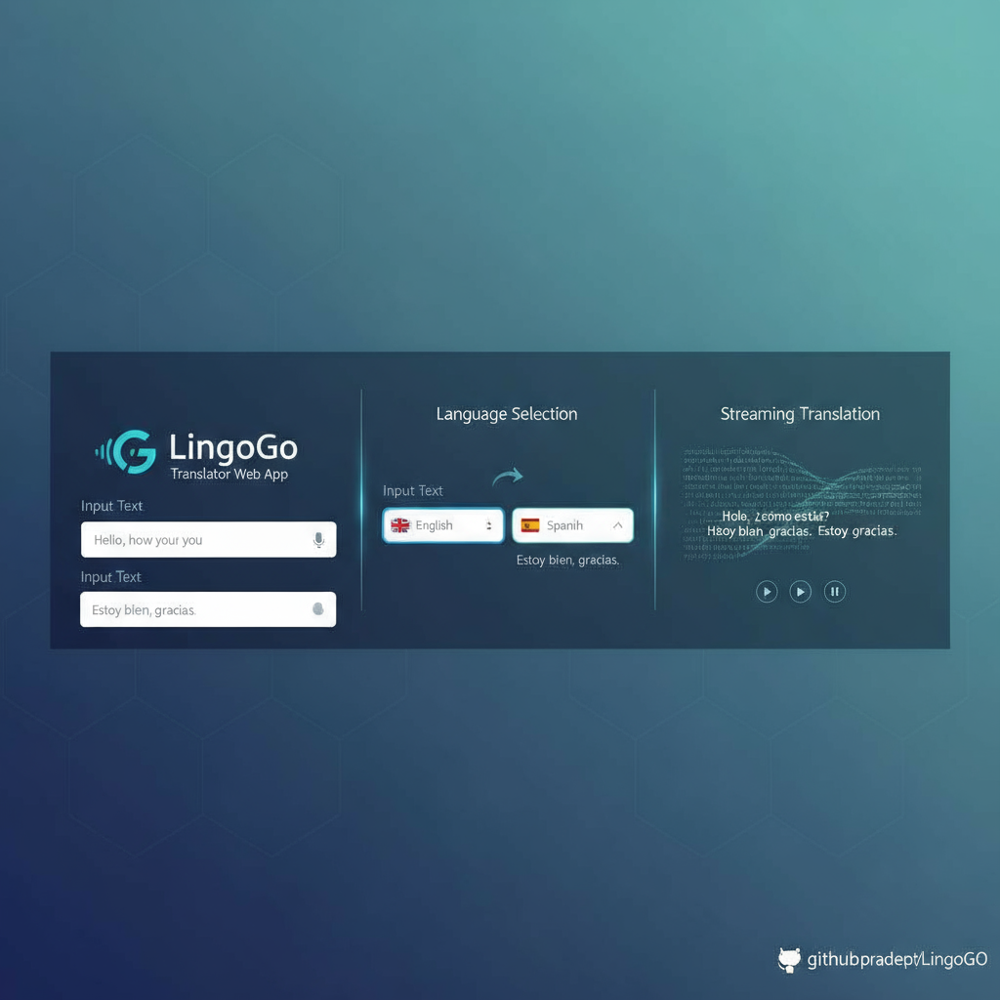

# LingoGo

A Modern All-in-One LLM Powered Translator Web App. 
 Powered by <b>Next</b>, <b>Langchain and Perplexity API</b>

## Features

- Translate to 100s of languages.
- Instant and accurate response.
- Sleak User Interface for ideal User Experience.

## Implementations

- Perplexity Configuration ✅
- Prompt Template ✅
- User Input Form ✅
- Refining LLM Response ✅
- Response Streaming(SSE) with UX ✅

## Run Locally

(clone the repo)
- ``git clone <repo-url>``
- ``cd <project-folder>``

(without docker)
- Install the dependencies
  ` npm i`
- add a `.env` file. Update values as per **example.env**.
- Run the app `npm run dev`
- Running at - `localhost:3000`

(using docker)
- ``docker build -t lingogo:latest .``
- ``docker run --name lingogo -p 3000:3000 lingogo:latest``

## Developers Reference

Fig: LLM Response Streaming.

- https://js.langchain.com/docs/
- https://js.langchain.com/docs/integrations/chat/perplexity/

## NOTE

If you find this project helpful, please consider leaving a ⭐ on the repository.
Feel free to connect with [me](https://pradeept.netlify.app).
